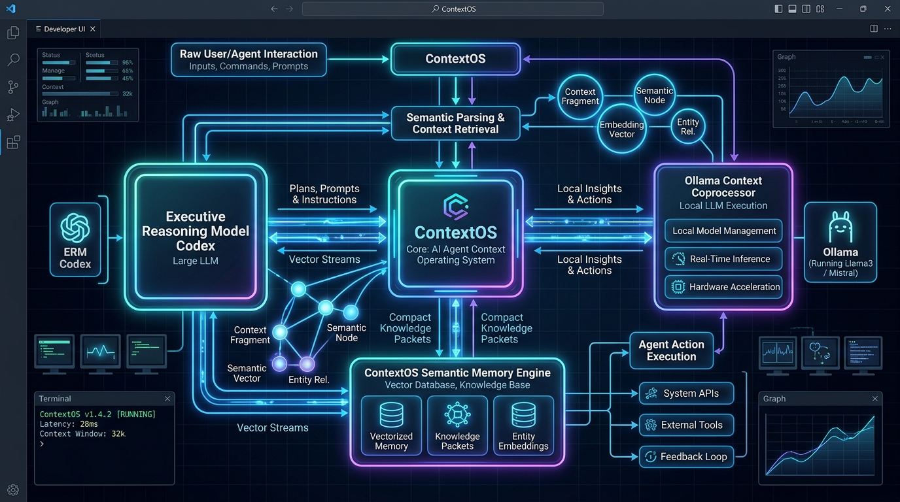
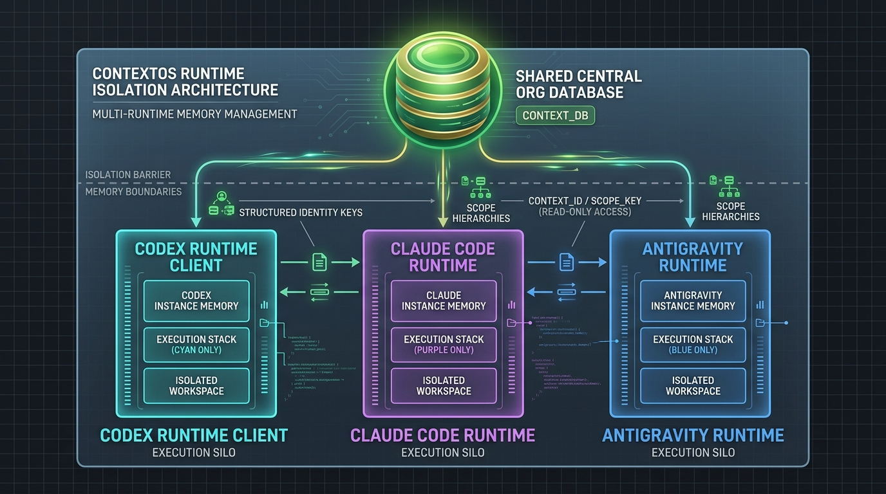
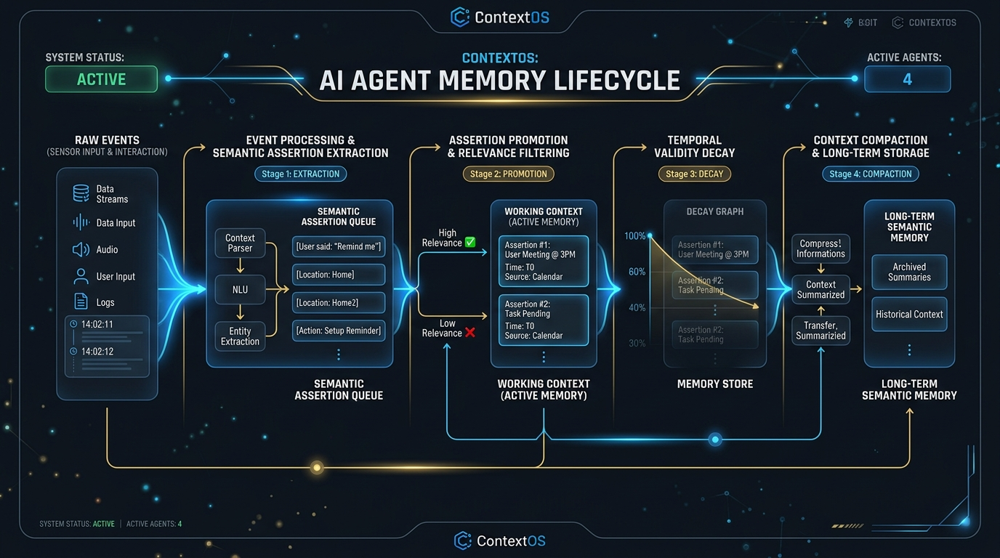

# ContextOS — AI Agent Context Operating System & Semantic Memory Engine

[](LICENSE)
[](pyproject.toml)
[](tests/)
[](ContextOS_MASTER_SPEC.md)

ContextOS is a domain-independent semantic memory system and context compiler designed for autonomous AI agent runtimes (**Codex**, **Claude Code**, **Antigravity**, and **OpenClaw**). Rather than injecting raw, uncompressed chat transcripts or relying solely on unbounded vector stores, ContextOS compiles the **smallest trustworthy working world-model** necessary for an agent's immediate task.



---

## 💡 Executive Summary & Core Philosophy

In long-running autonomous agent sessions using Codex, Claude Code, OpenClaw, or local models, context bloat poses significant operational challenges: repeatedly resending growing histories multiplies input-token usage, long sessions eventually hit context limits or require compaction of older context, and plain vector-only retrieval does not explicitly model temporal ordering, supersession, or state transitions. ContextOS resolves this by compiling the **smallest trustworthy working world-model** necessary for an agent's next act of reasoning.

### 🏛️ The Tripartite Symbiotic Architecture
- **Executive Reasoning Model (Codex / Claude / Antigravity)**: Acts as the primary decision engine executing tools, writing code, and orchestrating workflows.
- **Local Context Coprocessor (Ollama)**: Local LLM service (`nomic-embed-text` & `qwen2.5:1.5b`) handling fast vector embeddings, candidate reranking, and semantic assertion extraction using local inference without per-token API charges.
- **ContextOS Engine**: Maintains the canonical semantic IR, enforces multi-runtime/workspace boundary isolation, project facts, goal tracking gates, and temporal validity management.

---

## 🌐 Multi-Runtime Architecture & Memory Isolation

ContextOS cleanly isolates runtime execution environments while maintaining a shared foundation of organizational truth.



### 1. Mandatory 5-Part Identity Key
Every session, agent, and subagent is scoped by an immutable 5-part key:
$$\text{Identity Key} = \text{runtime\_id} : \text{workspace\_id} : \text{project\_id} : \text{session\_id} : \text{agent\_id}$$

This ensures that subagents inside the same session (e.g. `codex:default:project_a:sess_1:subagent-research`) maintain isolated execution state without overwriting parent goals.

### 2. Dual-Store Physical Hierarchy
- **Shared Organization Truth (`.contextos/shared/`)**: Holds durable `project`, `workspace`, and `global` assertions (`shared_semantic.db`, `shared_sources.json`).
- **Client-Local Execution (`.contextos/clients/<runtime_id>/`)**: Holds runtime-local transient/session state (`events.db`, `semantic.db`, `vector.db`, `context_versions/`).

---

## 🔄 AI Agent Memory Lifecycle Management

ContextOS transforms raw interaction streams into verifiable assertions, managing temporal validity and compacting context windows seamlessly.



1. **Event Sourcing Log**: All incoming prompts and tool outputs are recorded in an append-only, SHA-256 content-addressed JSONL event store.
2. **Semantic Assertion Extraction**: Local Ollama coprocessor extracts structured assertions (`subject`, `predicate`, `object`, `kind`, `confidence`).
3. **Assertion Promotion**: Session facts verified as project invariants are promoted to the shared store via `promote_assertion` with origin metadata preserved.
4. **Temporal Validity & Versioning**: Assertions track `observed_at`, `valid_from`, and `valid_until` timestamps. Deprecated facts are marked `status = 'superseded'` via `supersede_assertion`.
5. **Compaction & Rehydration**: PreCompact and PostCompact hooks allow ContextOS to rehydrate essential invariants without losing critical context after window truncation.

---

## ⚡ Quick Start & Installation

### Prerequisites
- Python 3.12+
- [Ollama](https://ollama.com) (Local Coprocessor)
- macOS / Linux

### 1. Installation

```bash
# Clone repository
git clone https://github.com/WatersWorks-Technology-LLC/ContextOS.git
cd ContextOS

# Install package in editable mode
pip install -e .
```

### 2. Hydrate Local Ollama Coprocessor

```bash
ollama pull nomic-embed-text
ollama pull qwen2.5:1.5b
```

### 3. Run Test Suite

```bash
PYTHONPATH=src pytest tests/unit/ tests/integration/ tests/live/
```

---

## 🛠️ Codex & Model Context Protocol (MCP) Integration

ContextOS connects to Codex via Model Context Protocol (MCP) and lifecycle hook handlers.

### 1. Codex MCP Tool Registration (`~/.codex/config.toml`)

```toml
[mcp.servers.contextos]
command = "python3"
args = ["-m", "contextos.mcp.server"]
cwd = "/path/to/your/workspace"
```

### 2. Global Lifecycle Hooks (`~/.codex/hooks.json`)

```json
{
  "hooks": {
    "SessionStart": [{
      "hooks": [{
        "type": "mcp_tool",
        "server": "contextos",
        "tool": "session_start",
        "input": { "session_id": "${session_id}" },
        "timeout": 10
      }]
    }],
    "UserPromptSubmit": [{
      "hooks": [{
        "type": "mcp_tool",
        "server": "contextos",
        "tool": "prepare_turn",
        "input": { "prompt": "${prompt}", "session_id": "${session_id}" },
        "timeout": 10
      }]
    }],
    "Stop": [{
      "hooks": [{
        "type": "mcp_tool",
        "server": "contextos",
        "tool": "evaluate_stop",
        "input": { "session_id": "${session_id}" },
        "timeout": 10
      }]
    }]
  }
}
```

---

## 📚 Complete Specification & Index

For detailed deep-dives, consult the documentation modules:

- **[Master Specification](ContextOS_MASTER_SPEC.md)**: Comprehensive architectural reference.
- **[Documentation Sitemap (`docs/00_INDEX.md`)](docs/00_INDEX.md)**:
  - [`02_PRD.md`](docs/02_PRD.md) — Product Requirements & Goals
  - [`03_SYSTEM_ARCHITECTURE.md`](docs/03_SYSTEM_ARCHITECTURE.md) — Subsystem Diagrams & Dataflow
  - [`04_CODEX_INTEGRATION.md`](docs/04_CODEX_INTEGRATION.md) — Codex & Claude Code Hook Handlers
  - [`05_MCP_INTERFACE.md`](docs/05_MCP_INTERFACE.md) — Protocol Specifications
  - [`07_OLLAMA_COPROCESSOR.md`](docs/07_OLLAMA_COPROCESSOR.md) — Reranking & Vector Embeddings
  - [`08_DATA_MODEL.md`](docs/08_DATA_MODEL.md) — SQLite Schemas & Temporal Validity
  - [`14_NCC_VCL_SPEC.md`](docs/14_NCC_VCL_SPEC.md) — Compact Context Codec Specification

---

## 📄 License

Distributed under the MIT License. See [`LICENSE`](LICENSE) for details.

Copyright © 2026 **WatersWorks Technology LLC**. All Rights Reserved.
